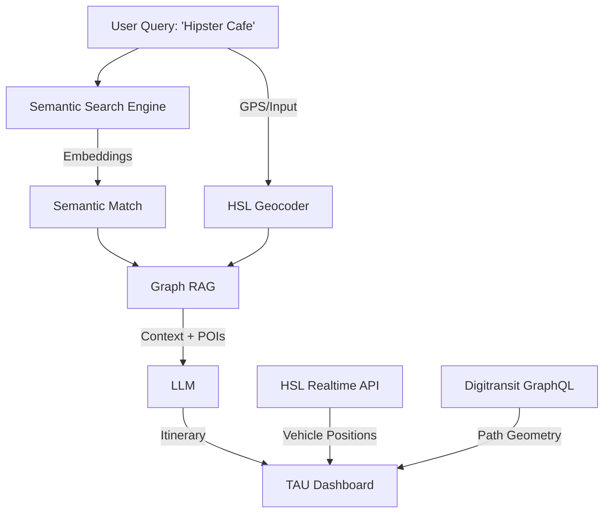

# 🚋Cognitive City Navigator

A Next-Gen Semantic Travel Guide powered by Knowledge Graphs, Vector Search, and Real-Time IoT Data.

---

## Features

-  **Semantic "Vibe" Search**: Don't search for "Bar." Search for "gloomy aesthetic with cheap beer." Our Vector Engine finds the best matches.
-  **Vibe Heatmaps**: Visualizes the density of your interest across the city using glowing 2D heat layers.
-  **Hybrid Graph-RAG**: Uses Neo4j to understand connectivity between Stops and POIs, and Llama-3 to generate witty, context-aware itineraries.
-  **Live Digital Twin**: Real-time tracking of Trams (Green), Buses (Blue), and Metro (Orange) using the HSL GTFS-RT feed.
-  **Cinematic Routing**: Renders exact street-level path geometry (not just straight lines) using the Digitransit GraphQL API.
  
---

## Tech Stack

| Component | Technology | Description |
|-----------|------------|-------------|
| **Frontend** | Streamlit | Custom "Nordic Night" Glassmorphism UI |
| **Visualization** | PyDeck (Deck.gl) | 3D ArcLayers, PathLayers, and HeatmapLayers |
| **Knowledge Graph** | Neo4j | Stores Stops, Routes, POIs, and `IS_NEAR` relationships |
| **Vector DB** | FAISS / Local | In-memory semantic index using `sentence-transformers` |
| **LLM** | Groq (Llama-3) | Generates route narratives and tour scripts |
| **Data Source** | Digitransit API | GraphQL for routing, GTFS-RT for live vehicles |
| **ETL** | Python | Custom scripts to fetch OSM & GTFS data |

---

## Architecture


## Demo


https://github.com/user-attachments/assets/318fc968-f1a7-4842-ac87-f222acb5645e


---

## Quick Start

### 1. Prerequisites

- Docker & Docker Compose
- A [Groq API Key](https://groq.com/) (for LLM features)
- A Digitransit API Key (for Routing/Geocoding)

### 2. Environment Setup

Create a `.env` file in the root directory:

```env
NEO4J_URI=bolt://neo4j_db:7687
NEO4J_USER=neo4j
NEO4J_PASSWORD=your_password
GROQ_API_KEY=your_key_here
DIGITRANSIT_API_KEY=your_digitransit_key
```

### 3. Run with Docker

The easiest way to spin up the Graph DB and the App simultaneously.

```bash
docker-compose up --build
```

Access the app at **http://localhost:7860**.

### 4. Initialize Data (Important!)

On the first run, the database will be empty.

1. Open the app sidebar.
2. Click **"Reload Graph"**.

This triggers the ETL pipeline:
- `etl_neo4j.py`: Fetches Stops from HSL and nodes them in Neo4j.
- `etl_enrich.py`: Fetches POIs from OpenStreetMap, connects them to Stops, and indexes them for Vector Search.

---
